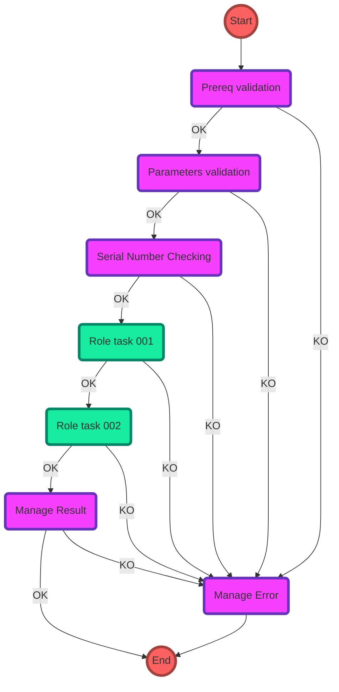

# sl_automation

TODO: Write down how to use the project

## Project Description

This is My Ansible Project

## Features

* TODO

## Executing Ansible using Python Virtual Environments

Two options to execute Python and Ansible inside virtual environments: venv and pipenv.

### venv and requirments.txt

```bash
<PYTHON_PATH>/python<PYTHON_VER> -m venv <venv_name>
source <venv_name>/bin/activate
pip install --upgrade pip
pip install -r requirements.txt
```

### pipenv and pipfile

Documentation: <https://pipenv-es.readthedocs.io/es/latest/>

Install pipenv as a Python module:

```bash
sudo python -m pip install pipenv # esto lo instala en el /usr/local/bin. Esta es la forma buena.
```

Create virtual environment folder:

```bash
mkdir -p ~/pipenv/ansible2.9
```

Create Pipfile in the virtual environment folder:

```ini
[[source]]
url = "https://pypi.org/simple"
verify_ssl = true
name = "pypi"

[packages]
ansible = "==2.9"

[dev-packages]

[requires]
python_version = "3.10"
```

Create the virtual environment using the Pipfile:

```bash
cd ~/pipenv/ansible2.9
pipenv install
```

## Visual Studio Code Recommended Extensions for Ansible

* [gitlens](https://marketplace.visualstudio.com/items?itemName=eamodio.gitlens)
* [vscode-markdownlint](https://marketplace.visualstudio.com/items?itemName=DavidAnson.vscode-markdownlint)
* [EditorConfig](https://marketplace.visualstudio.com/items?itemName=EditorConfig.EditorConfig)
* [pre-commit-helper](https://marketplace.visualstudio.com/items?itemName=elagil.pre-commit-helper)
* [todo-tree](https://marketplace.visualstudio.com/items?itemName=Gruntfuggly.todo-tree)
* [git-graph](https://marketplace.visualstudio.com/items?itemName=mhutchie.git-graph)
* [python](https://marketplace.visualstudio.com/items?itemName=ms-python.python)
* [editorconfiggenerator](https://marketplace.visualstudio.com/items?itemName=nepaul.editorconfiggenerator)
* [ansible](https://marketplace.visualstudio.com/items?itemName=redhat.ansible)
* [vscode-yaml](https://marketplace.visualstudio.com/items?itemName=redhat.vscode-yaml)
* [markdown-all-in-one](https://marketplace.visualstudio.com/items?itemName=yzhang.markdown-all-in-one)

```bash
code --install-extension DavidAnson.vscode-markdownlint
code --install-extension eamodio.gitlens
code --install-extension EditorConfig.EditorConfig
code --install-extension elagil.pre-commit-helper
code --install-extension Gruntfuggly.todo-tree
code --install-extension mhutchie.git-graph
code --install-extension ms-python.python
code --install-extension nepaul.editorconfiggenerator
code --install-extension redhat.ansible
code --install-extension redhat.vscode-yaml
code --install-extension yzhang.markdown-all-in-one
```

You can extract your installed VSC extensions and generate the install commands using the following commands:

In Windows:

```powershell
code --list-extensions | % { "code --install-extension $_" }
```

Or Linux:
```bash
code --list-extensions | xargs -L 1 echo code --install-extension
```

## Repository Contents

| File/Folder | Description | More Info |
|-------------|-------------|-----------|
| README.md | This file ||
| collections | Ansible Collections Folder. Only contains the requirements.yml file| <https://docs.ansible.com/ansible/5/user_guide/collections_using.html#install-multiple-collections-with-a-requirements-file> |
| hooks | Pre-Commit hooks folder | <https://pre-commit.com/> |
| inventories | Ansible inventories and group_vars folder| <https://docs.ansible.com/ansible/latest/inventory_guide/intro_inventory.html> |
| playbooks | Ansible playbooks folder. Contains one subfolder for each playbooks group and a common pretasks.yml file ||
| roles | Ansible roles folder | Contains one subfolder for each role and a requirements.yml file to pull down and install common roles from Ansible Galaxy | More info in <roles/first_role/README.md> file inside role folder|
| tests | Ansible tests folder. Contains reference to several testing tools | More info in <tests/README.md> |
| vars | Contains the vars and secrets files hierarchy by env (DEV,PRE,PRO,global) and by playbooks_subfolders (playb1). These files are loaded by the pretasks.yml file when a playbook is executed ||
| .ansible-lint | Ansible lint tool. Can be used from cli or from pre-commit tool. | <https://ansible.readthedocs.io/projects/lint/> |
| .editorconfig | Editorconfig configuration file | <https://editorconfig.org/> |
| .gitattributes | Defining attributes per path | <https://www.git-scm.com/docs/gitattributes> |
| .gitignore | Specifies intentionally untracked files to ignore | <https://git-scm.com/docs/gitignore> |
| .pre-comit-config.yml | A framework for managing and maintaining multi-language pre-commit hooks. | <https://pre-commit.com/> |
| .pylintrc | Pylint is a static code analyser for Python 2 or 3. | <https://pypi.org/project/pylint/> |
| .yamlint | A linter for YAML files. | <https://yamllint.readthedocs.io/en/stable/>|

## Mermaid Diagrams

Mermaid will be used to generate diagrams inside markdown documents: [Mermaid](https://mermaid.js.org/intro/)

A flowchart example:



Guidelines (please, review mermaid code in ext mode view):

* Defined three format classes:
  * Start and end nodes: circle class
  * Generic nodes: generic class
  * Tasks role nodes: default class
* HPE color palette is used: [HPE color palette](https://design-system.hpe.design/foundation/color).
* Nodes names follow N\[0-9]\[0-9]\[0-9] convention, between N000(Start) and N999(End).
* Initial steps between nodes: 10 units (ie, N010, N020, etc.).
* Branch nodes should be avoided where possible for diagram simplicity.
